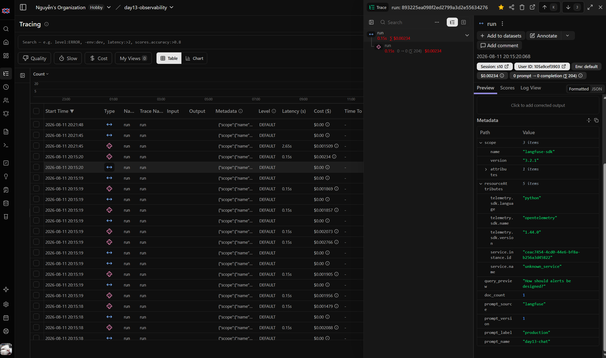
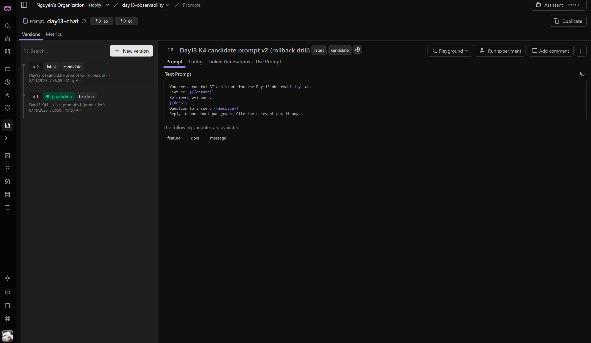
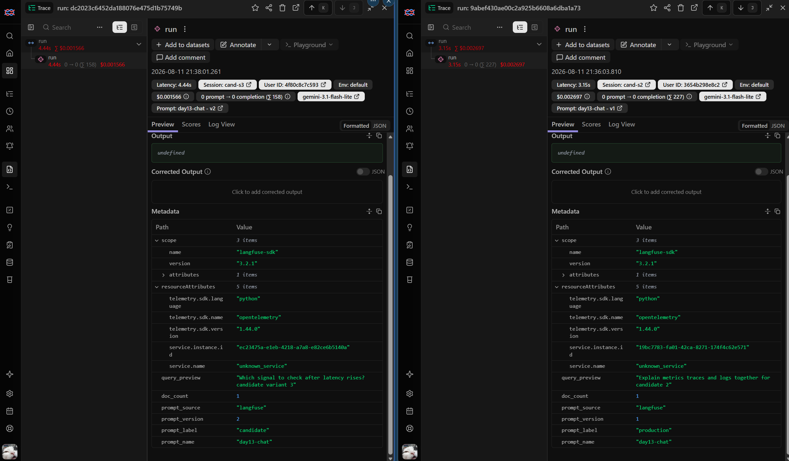
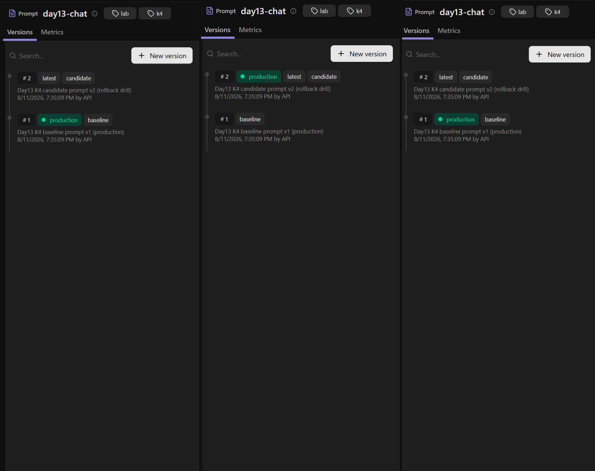
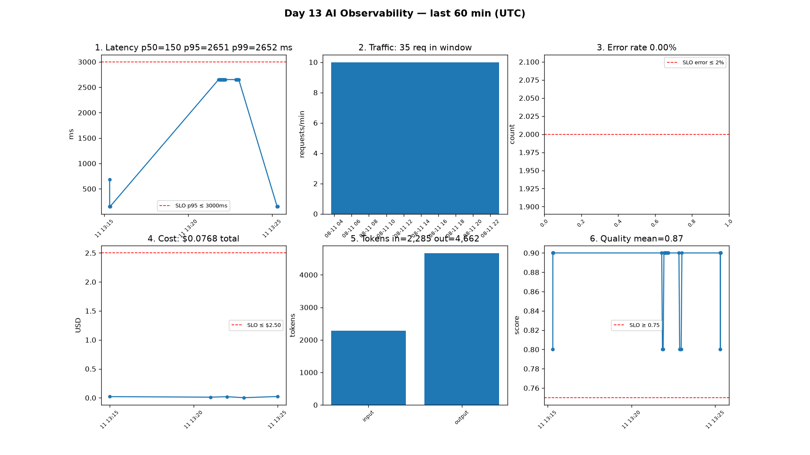
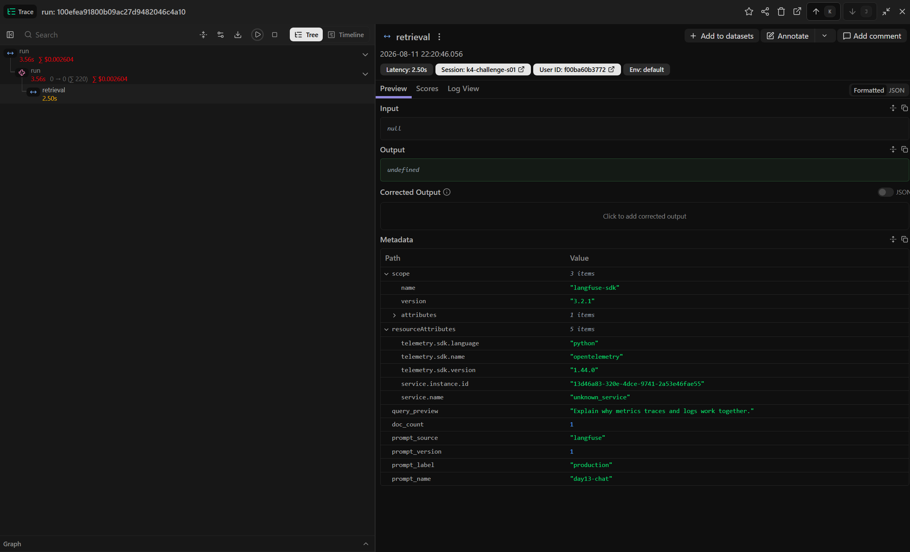

# Báo cáo Day 13 Observability

## 1. Thông tin nhóm

- Tên nhóm: **K4 — T104**
- Repository URL: `https://github.com/QuocAnh-Nguyen/Day13-K4-Observability-T104.git`
- Commit SHA cuối: `5960c795d94a3d24972c719fb33a5320474f3ebf` (HEAD trên `main`, sẵn sàng push lên `origin`)
- Thành viên và vai trò:
  - **Nguyễn Quốc Anh** (`2A202601100`) — Logging & PII; Tracing & Prompt versioning.
  - **Hoàng Bảo Huy** (`2A202601440`) — Dashboard, SLO & Alerts.
  - **Trương Ái Linh** (`2A202601496 `) — Incident, Report & Evidence.

## 2. Kết quả kỹ thuật

- Điểm `validate_logs.py`: **100/100** (xem `submission/evidence/validate_logs.txt`).
- Tổng số traces: **≥ 10** (baseline `--concurrency 5` + challenge; danh sách 10 trace tại `submission/evidence/trace_ids.txt`; 5 trace challenge tại `challenge_evidence.txt`).
- Số PII leak còn lại: **0** (`validate_logs.txt`: "Potential PII leaks detected: 0").
- Link/đường dẫn dashboard: Streamlit `python scripts/dashboard.py` (đọc `data/logs.jsonl`); bản static 6 panel tại `submission/evidence/dashboard_6panels.png`.

## 3. Logging và tracing

- Evidence correlation ID: `submission/evidence/correlation_id_logs.jsonl` — cùng `req-b43be1b9` trên cả `request_received` và `response_sent`.
- Evidence PII redaction: `submission/evidence/pii_log_line.jsonl` — các dòng log **thực** trong `request_received` có `[REDACTED_EMAIL]`, `[REDACTED_PHONE_VN]`, `[REDACTED_CREDIT_CARD]` (kèm correlation ID + model); kèm `submission/evidence/pii_redaction.txt` show input thô vs giá trị đã scrub (`[REDACTED_EMAIL]`, `[REDACTED_PHONE_VN]`, `[REDACTED_PASSPORT_VN]`, `[REDACTED_CREDIT_CARD]`).
- Evidence trace waterfall: `submission/evidence/trace_waterfall.json` — trace `f4c7a4ed9cc6a1fb987409ddc0e6d9fd` (3 tầng: trace → GENERATION `run` 3.49s → SPAN `retrieval` 2.5s).
  
- Giải thích một span đáng chú ý: span `SPAN "retrieval"` (`f127cefd930f0b29`, 2.5s) chiếm hầu hết thời lượng của GENERATION `run` (3.49s) trong trace challenge; đây chính là tầng gây chậm do incident `rag_slow` (`time.sleep(2.5)` trong `mock_rag.retrieve`). Ảnh chụp waterfall phải thấy rõ span `retrieval` tách riêng để chứng minh "retrieval là nguồn gây chậm".

## 4. Prompt versioning

- Prompt name: `day13-chat`
- Version/label baseline: v1, label `production` (+ `baseline`), nội dung baseline
- Version/label candidate: v2, label `candidate`, nội dung thay đổi rõ ràng
- Trace ID của mỗi version: hai version/label khác nhau trong `submission/evidence/prompt_versions.txt`
  - `production`/v1: trace `0276a49b3a1f48beaf73628aa53b4e5e`, `0f2ad64dd6bb96ed538624ad6d51b4da`.
  - `candidate`/v2: trace `a6dfc72cee0fddd126c3af021a5bdd75`, `dc2023c6452da188076e475d1b75749b` (chạy app với `LANGFUSE_PROMPT_LABEL=candidate`).
  - Ảnh danh sách hai version: 
  - Ảnh trace hiển thị name/label/version cho cả production(v1) và candidate(v2): 
- Bằng chứng đổi label hoặc rollback: `submission/evidence/prompt_rollback.txt` — label `production` v1 → v2 → v1.
  

## 5. Dashboard, SLO và alerts

- Kết quả `validate_dashboard.py`: **HỢP LỆ: 6/6 panel** (`submission/evidence/validate_dashboard.txt`).
- Evidence dashboard: `submission/evidence/dashboard_6panels.png` (6 panel: latency p50/p95/p99, traffic, error, cost, tokens, quality; mỗi panel có SLO line + đơn vị).
  
- SLO đã chọn và lý do: `config/slo.yaml` — `latency_p95_ms ≤ 3000ms` (ngưỡng tương ứng incident rag_slow 2.5s), `error_rate_pct ≤ 2%`, `daily_cost_usd ≤ 2.5USD`, `quality_score_avg ≥ 0.75`.
- Alert rules và runbook: `config/alert_rules.yaml` (3 alert symptom-based: `high_latency_p95`, `error_rate_breach`, `cost_breach`) + runbook tại `docs/alerts.md#alert-1/2/3`.

## 6. Điều tra challenge

- Challenge ID: `day13-k4-observability-v1` (cohort K4, `config/challenge.json`).
- Triệu chứng từ metrics: toàn bộ 5 query `monitoring` có `latency_ms ≈ 2650ms > 2000ms` (ngưỡng `latency_threshold_ms`), 5/5 là BREACH.
- Trace ID liên quan: `100efea91800b09ac27d9482046c4a10`, `64e78098053784de36ab2a0b031bb998`, `3db803d06440309ae19b64c230df65d1`, `f4c7a4ed9cc6a1fb987409ddc0e6d9fd`, `58037bb17543dc0d03d761bd48b1feb0` — mỗi trace có `SPAN "retrieval"` 2.5s tách riêng.
- Log line/correlation ID liên quan: `req-9590fa60`, `req-dd8a407c`, `req-a4c31e1b`, `req-8a1e586b`, `req-4a1a84e9` — log `response_sent` có `latency_ms ≥ 3487ms` (chi tiết tại `submission/evidence/challenge_evidence.txt`).
  
- Root cause: `STATE["rag_slow"]` thêm `time.sleep(2.5)` trong `app/mock_rag.retrieve()` (app/mock_rag.py:17-18), làm mọi request feature `monitoring` vượt ngưỡng 2000ms.
- Fix action: tắt incident `rag_slow` (`scripts/inject_incident.py --disable`); loại bỏ delay trong `mock_rag.retrieve`.
- Preventive measure: đặt timeout/circuit-breaker cho bước retrieve; theo dõi SLO `latency_p95` qua alert `high_latency_p95` để phát hiện sớm, không đợi user phàn nàn.

## 7. Đóng góp cá nhân

| Thành viên      | Phần việc                                                                                                                                                               | Commit/PR            | Điều đã học                                                                                                                               |
| --------------- | ----------------------------------------------------------------------------------------------------------------------------------------------------------------------- | -------------------- | ----------------------------------------------------------------------------------------------------------------------------------------- |
| Nguyễn Quốc Anh | Logging & PII (middleware correlation ID, contextvars, scrub_event trước JSON renderer), Tracing & Prompt versioning (seed `day13-chat` v1/v2 trong Langfuse, rollback) | `f041008`, `7a35846` | Vòng đời contextvar structlog, thứ tự PII processor trước renderer, prompt label/version trong trace khi đổi label không làm mất version. |
| Hoàng Bảo Huy   | Dashboard Streamlit 6 panel, SLO, alert rules, runbook; Bonus: cache response (cost), audit log, anomaly detector | `77a2276`, `eaba8b8` | Cách tính percentile p50/p95/p99, contract panel, cache response đưa cost ~0 cho traffic lặp lại |
| Trương Ái Linh  | Chạy load/challenge, chụp evidence, soạn báo cáo                                                                                                                        | `030537d`            | Luồng điều tra Metrics → Traces → Logs → root cause và cách dẫn chứng mỗi claim bằng trace ID + log line + metric.                        |

## 8. Bonus

### 8.1 Cost optimization (trước/sau)

Triển khai cache response trong `app/response_cache.py` (bật bằng `RESPONSE_CACHE=1`): cache theo key `sha256(feature + message)`, request trùng lặp bỏ qua LLM.

- **Before** (cache tắt, incident `cost_spike`): 10 query = **$0.0825** / 5372 tokens / ~310ms.
- **After** (cache bật, chạy lại 10 query giống hệt): **$0.00** / 0 tokens / ~10ms (100% tiết kiệm cho traffic lặp lại).
- Evidence: `submission/evidence/cost_before_after.txt`.

### 8.2 Audit log tách riêng

`app/audit.py` ghi trail riêng `data/audit.jsonl` cho các sự kiện điều khiển quan trọng: `incident_enabled` / `incident_disabled` (nối vào endpoint control trong `app/main.py`) và `prompt_label_change` (nối vào `scripts/seed_langfuse_prompts.py --rollback`).

- Evidence: `submission/evidence/audit_log.jsonl` (ghi `incident_enabled`/`incident_disabled` cho `cost_spike`).

### 8.3 Custom automation — Anomaly detector

`scripts/anomaly_detector.py` tự quét `data/logs.jsonl`:

- Phát hiện **PII leak** (email, phone VN, CCCD, thẻ, passport).
- Phát hiện **latency vượt SLO p95** và **error rate**.
- Exit code ≠ 0 khi có anomaly (dùng cho alert tự động).

Evidence:
- Baseline healthy: `submission/evidence/anomaly_report.json` (0 leak, 0 breach).
- Đã kích hoạt trên log có PII + breach: `submission/evidence/anomaly_report_detects.json` (email leak `req-aaaa1111`; latency 4500ms > 3000ms).
